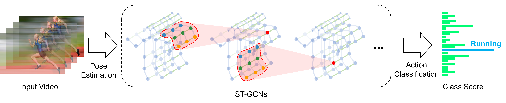

# Skeleton based cyclist hand signal and attention recognition

We developed a skeleton based behavour recognition algorithm and a new Cyclist Behaviour Recognition dataset for **autonomous vehicles** to identify:

- cyclists hand signals/gestures for their intention of next move
- cyclists' attention/notice, i.e. whether the cyclist notice vehicles beside or behind them

The algorithm is based on Spatio-Temporal Graph Convolution Network (ST-GCN).

## Introduction

### End-to-end pipeline

The pipeline of the algorithm is shown as follow. 
- The input video is processed by a pose estimation to obtain a sequence of human skeleton (consist of a group of human joints)
- We extract the spatio and temporal information via ST-GCN and finally make classification over the features



### Cyclist Behaviour Recognition dataset

3 classes of cyclist behaviours:
- Looking over shoulder: notice (the vehicle) behind, at the left and at the right
- Turning-left gesture
- Turning-right gesture


## Get Ready

### Prerequisites
- PyTorch
- NumPy
- Others: `pip install -r requirements.txt`

### Data Preparation
Download the skeleton datasets which are generated by Openpose:
1. Cyclist skeleton dataset: 
		https://pan.baidu.com/s/1htbqWI0srX5A38xQu_xh5A
2. Kinetics skeleton dataset: 
		https://s3-us-west-1.amazonaws.com/yysijie-data/public/kinetics-skeleton/kinetics-skeleton.zip
or download the original video dataset and then generate the skeletons by Openpose
0. Openpose:
		https://github.com/CMU-Perceptual-Computing-Lab/openpose
1. Cyclist video dataset: 
		https://pan.baidu.com/s/1MylaSe7qgcPFEP775UIkxw
2. Kinetics video dataset: 
		https://deepmind.com/research/open-source/open-source-datasets/kinetics/

### Quick Start

The following files are the main ones to quickly start with:

	'work_dir' - includes the trained model
	'convert-openpose' - includes the Python scripts which can generate the skeleton dataset using the output of Openpose
	'config' - includes the configuration files of the test or training.


##  Testing Pretrained Models
```
$ python main.py --config config/st_gcn/<dataset>/test.yaml
```

1. To evaluate ST-GCN model pretrained on **cyclist**, run

		$ pyhon main.py --config config/st_gcn/cyclist/test.yaml

2. To evaluate ST-GCN model pretrained on **Kinetcis-skeleton**, run

		$ python main.py --config config/st_gcn/kinetics-skeleton/test.yaml
3. Similary, the configuration file for testing baseline models can be found under the 
		`./config/baseline`.
4. To speed up evaluation by multi-gpu inference or modify batch size for reducing the memory cost, set ```--test-batch-size``` and ```--device``` like:

		$ python main.py --config <config file> --test-batch-size <batch size> --device <gpu0> <gpu1> ...


## Training
To train a new ST-GCN model, run 
```
python main.py --config config/st_gcn/<dataset>/train.yaml [--work-dir <work folder>]
```

## Citation
@inproceedings{stgcn2018aaai,
  title     = {Spatial Temporal Graph Convolutional Networks for Skeleton-Based Action Recognition},
  author    = {Sijie Yan and Yuanjun Xiong and Dahua Lin},
  booktitle = {AAAI},
  year      = {2018},
}

